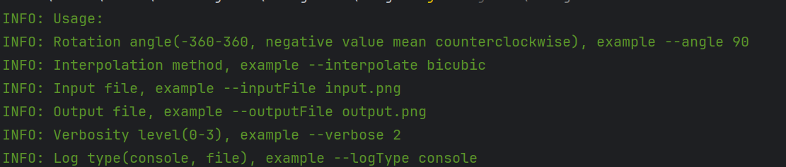
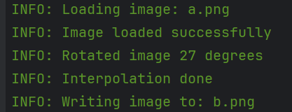

# Java Image Manipulation Tool

## Overview

The Java Image Manipulation Tool is a lightweight yet powerful Java application for performing simple image manipulation tasks. At the moment only supported tasks are bicubic interpolation and rotation.\
The tool has minimal dependencies and all image processing functionality is written from scratch without any use of external libraries.\
The tool supports at the moment only JPGS and PNGS, more filetypes coming soon.
## Features

- **Bicubic Interpolation:** Enhance image quality after rotation using interpolation(bicubic, other options coming soon). Recommended especially for small PNG images.
- **Rotation:** Rotate images to the desired orientation effortlessly.

## Screenshots





## Getting Started

To get started with the Java Image Manipulation Tool, follow these simple steps:

1. Clone the repository:

    ```
    git clone https://github.com/OnlyGIGO/Java-Image-manipulation-tool.git
    ```

2. Navigate to the project directory:

    ```
    cd Java-Image-manipulation-tool
    ```

3. Compile the source code using Maven:

    ```
    mvn clean package
    ```

4. Run the application:

    ```
    java -jar target/JImageTool-1.0-SNAPSHOT-Shaded.jar
    ```

## License

This project is licensed under the terms of the [MIT License](LICENSE).
